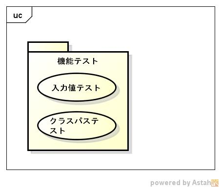
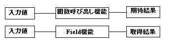

proxyjnitest
============
libproxyjniのtestプログラムです。

1. テスト分析
    1. テスト対象分析
    
        FV表  
        
        <table border="1">
        <tr>
            <th>no.</th>
            <th>目的機能(F)</th>
            <th>検証内容(V)</th>
            <th>テスト技法(T)</th>
        </tr>
        <tr>
            <td>6.i</td>
            <td>JVM起動</td>
            <td>JVM起動が起動できる事</td>
            <td>　</td>
        </tr>
        <tr>
            <td>6.ii</td>
            <td>javaクラス内のStatic Methodを実行</td>
            <td>パラメータを設定し、関数を実行できる事</td>
            <td>　</td>
        </tr>
        <tr>
            <td rowspan="2">6.iv</td>
            <td rowspan="2">javaクラス内のObject Methodを実行</td>
            <td>パラメータ無しで、クラスを生成できる事</td>
            <td>　</td>
       </tr>
        <tr>
            <td>パラメータを設定し、ObjectMethodを実行できる事</td>
            <td>　</td>
        </tr>
        <tr>
            <td rowspan="2">6.iii</td>
            <td rowspan="2">クラスを生成する</td>
            <td>パラメータ有で、クラスを生成できる事</td>
            <td>　</td>
       </tr>
        <tr>
            <td>パラメータを設定し、ObjectMethodを実行できる事</td>
            <td>　</td>
        </tr>
        <tr>
            <td>6.v, 6.vi</td>
            <td>javaクラス内のField変数の取得をする</td>
            <td>javaクラス内のField変数を設定し、その値を取得する</td>
            <td>　</td>
        </tr>
        <tr>
            <td>6.vii, 6.viii, 6.iX</td>
            <td>システムプロパティの設定/取得する</td>
            <td>javaクラス内のField変数を設定し、その値を取得する</td>
            <td>　</td>
        </tr>
        </table>
        
        データ型  
        |パラメータ型  |戻り型          |ハッシュ型    |Field型 |
        |--------------|----------------|--------------|--------|
        |              |戻り値無し      |              |        |
        |int型         |int型           |int型         |int型   |
        |long型        |long型          |long型        |long型  |
        |float型       |float型         |float型       |float型 |
        |double型      |double型        |double型      |double型|
        |文字列型      |文字列型        |文字列型      |文字列型|
        |int型の配列   |int型の配列     |int型の配列   |        |
        |long型の配列  |long型の配列    |long型の配列  |        |
        |float型の配列 |float型の配列   |float型の配列 |        |
        |double型の配列|double型の配列  |double型の配列|        |
        |Object型の配列|                |              |        |
        |ハッシュ型    |ハッシュ型      |ハッシュ型    |        |
        |              |ハッシュ型の配列|              |        |
        |Object型      |Object型        |Object型      |Object型|
    
    1. テスト要求分析
        * staticメゾッドのテスト
          - パラメータテスト
          - 戻り値テスト
        * オブジェクトメゾッドのテスト
          - パラメータテスト
          - 戻り値テスト
        * インスタンスメゾッドのテスト
        * Field設定/取得テスト
        * システムプロパティのテスト
          - クラスパス設定テスト
          - プロパパティ取得のテスト
        * フィールドのテスト
          - フィールド設定のテスト
          - フィールド取得のテスト  
    
1. テストアーキテクチャー
    1. テストコンテナ
    
        
    
    1. テストフレーム
    
        
    
    
