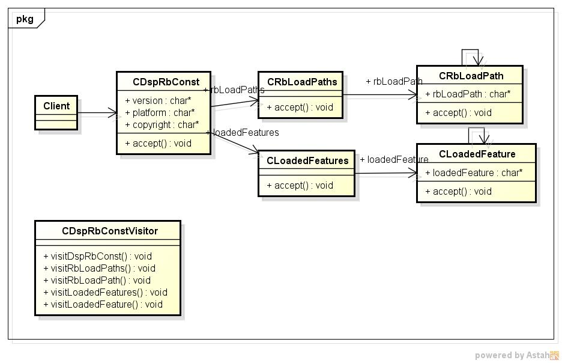

rbconst
=======
rubyの定数情報を表示

* 表示項目
  - RUBY_VERSION
  - RUBY_PLATFORM
  - RUBY_COPYRIGHT
  - $:
  - $LOADED_FEATURES  
  
* 使い方  
$ rbconst

* 出力サンプル  

<pre>
$ rbconst
  version:1.8.7
 platform:x86_64-linux
copyright:ruby - Copyright (C) 1993-2013 Yukihiro Matsumoto
 loadPath:
        /usr/lib64/ruby/1.8
        /usr/local/lib/site_ruby/1.8
        /usr/local/lib64/site_ruby/1.8/x86_64-linux
        /usr/local/lib/site_ruby
        /usr/lib64/ruby/vendor_ruby/1.8
        /usr/lib64/ruby/vendor_ruby/1.8/x86_64-linux
        /usr/lib64/ruby/vendor_ruby
        /usr/lib/ruby/1.8
        /usr/lib64/ruby/1.8/x86_64-linux
        .
LoadedFeatures:
        enumerator.so
</pre>

* クラス図  

* シーケンス図

