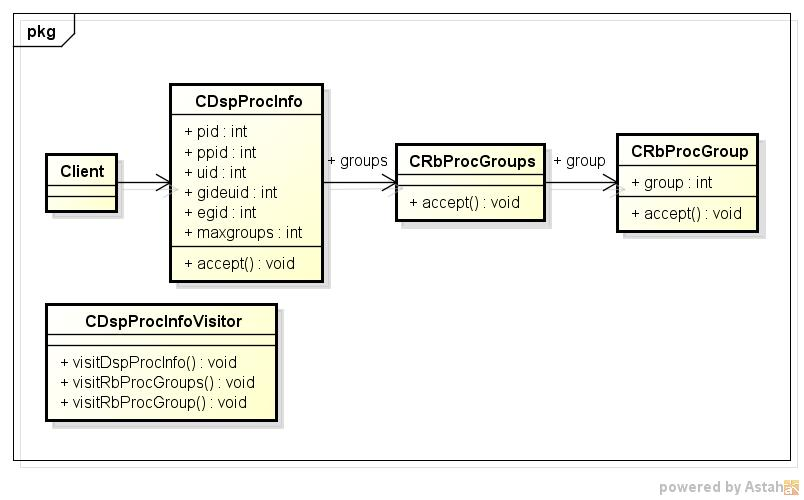

rbproc
======
rubyのProcess情報を表示

* 表示項目
  - pid、ppid
  - uid、gid、euid、egid
  - groups
  - maxgroups  

* 使い方  
$ rbproc

* 出力サンプル  

<pre>
$ rbproc
   pid:2827      ppid:2734
   uid: 500       gid: 500
  euid: 500      egid: 500
groups: 10 500
maxgroups:  32
</pre>

* クラス図  

* シーケンス図

